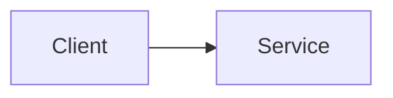

# Pattern Atlas MVP

Static-first Astro website for learning software architecture through:

- Bite-sized patterns
- Foundational concepts
- Guided scenarios
- Tradeoff comparisons
- Reasoning-focused quizzes

## Stack

- Astro + TypeScript
- Astro Content Collections (typed schemas)
- Markdown/MDX content
- Tailwind v4 (design tokens in global CSS)
- Preact islands for selective interactivity
- Pagefind local static search
- GitHub Pages deploy workflow

## Project structure

```text
src/
	components/
		islands/               # client-side interactive modules
	content/
		concepts/
		patterns/
		scenarios/
		comparisons/
		quizzes/
	layouts/
		MainLayout.astro
		ContentPageLayout.astro
		LibraryLayout.astro
	lib/
		content.ts             # collection helpers
		progress.ts            # local progress storage
		diagrams.ts            # mermaid snippets
		site.ts                # site config
	pages/
		index.astro
		concepts/
		patterns/
		scenarios/
		compare/
		quiz/
		progress.astro
		search.astro
		about.astro
```

## Commands

- `npm run dev` - start local dev server
- `npm run check` - run Astro + TypeScript checks
- `npm run build` - static build and Pagefind indexing
- `npm run preview` - preview production output

## Content authoring

Content is typed in `src/content.config.ts`. Add or edit files under:

- `src/content/patterns`
- `src/content/concepts`
- `src/content/scenarios`
- `src/content/comparisons`
- `src/content/quizzes`

Each entry includes explicit tradeoffs and links to related concepts.

### Concepts vs patterns

- Concepts define core properties and guarantees (what it means and why it matters), such as idempotency and eventual consistency.
- Patterns define reusable implementation structures (how to solve recurring problems), such as cache-aside and circuit breaker.

### Diagram authoring

Diagrams are authored directly in content markdown files using fenced Mermaid blocks.
This keeps diagrams GitHub-renderable and powers client-side rendering in the site.

Example:

~~~md
## Diagram


~~~

The first Mermaid block in each pattern/scenario page is used as the primary diagram.

## Deployment

GitHub Pages workflow is in `.github/workflows/deploy.yml`.

- `SITE_URL` and `BASE_PATH` are injected during CI.
- Astro static output is deployed from `dist`.
- Pagefind index is generated during `npm run build`.

## MVP boundaries

Included:

- Static content-first architecture handbook
- Local-only progress/history
- Quiz islands and interactive scenario variants
- Local search index

Not included:

- Authentication
- Payments
- Backend APIs
- External AI services
