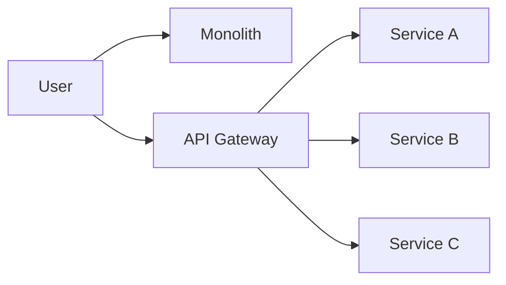

This comparison is about timing and organizational fit, not ideology.

## Diagram

```mermaid
flowchart LR
  User --> M[Monolith]
  User --> G[API Gateway]
  G --> S1[Service A]
  G --> S2[Service B]
  G --> S3[Service C]
```
