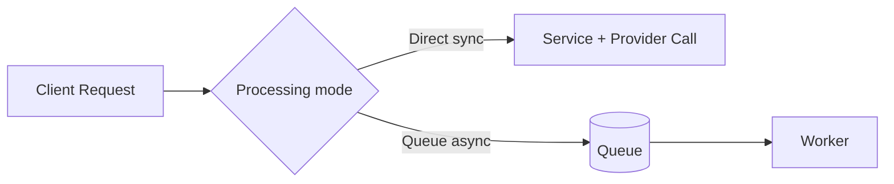

This comparison helps juniors distinguish user-facing latency from system completion latency.

## Diagram

```mermaid
flowchart LR
  Req[Client Request] --> D{Processing mode}
  D -->|Direct sync| Svc[Service + Provider Call]
  D -->|Queue async| Q[(Queue)]
  Q --> W[Worker]
```
