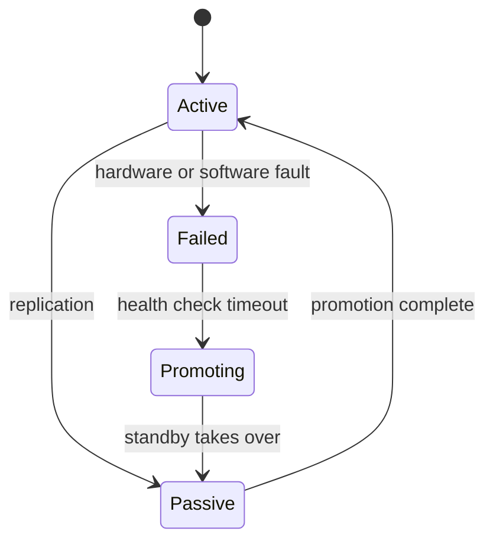

Active-passive failover is deceptively simple to describe but subtle to operate. The standby must continuously replicate from the active, the promotion mechanism must be reliable, and the system must prevent the old active from accepting writes after failover—the split-brain problem. Test your failover path as frequently as your recovery time objective requires.

## Diagram

