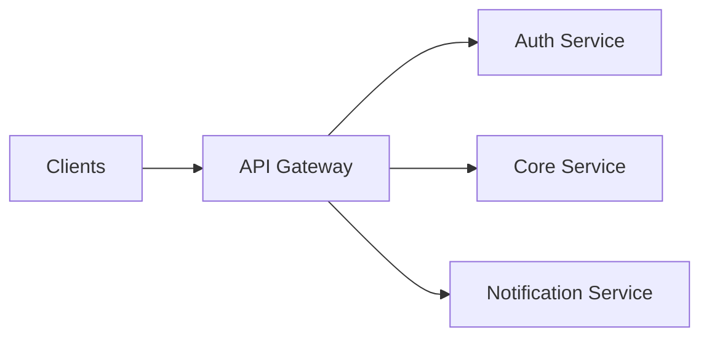

A gateway should enforce policy and composition, not become an all-purpose application server.

## Diagram

```mermaid
flowchart LR
  C[Clients] --> G[API Gateway]
  G --> A[Auth Service]
  G --> S[Core Service]
  G --> N[Notification Service]
```
