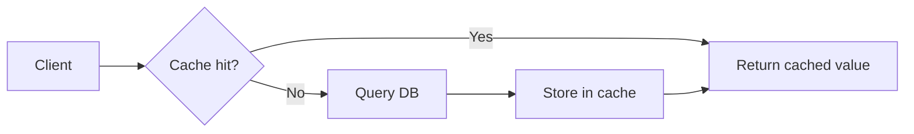

Cache-aside lets your application control when values are loaded and refreshed. It is usually the first caching pattern juniors should learn.

## Diagram

```mermaid
flowchart LR
  A[Client] --> B{Cache hit?}
  B -->|Yes| C[Return cached value]
  B -->|No| D[Query DB]
  D --> E[Store in cache]
  E --> C
```
