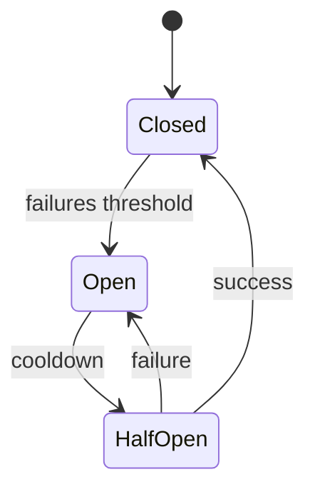

Circuit breakers shift teams from retrying blindly to designing explicit failure modes.

## Diagram

```mermaid
stateDiagram-v2
  [*] --> Closed
  Closed --> Open: failures threshold
  Open --> HalfOpen: cooldown
  HalfOpen --> Closed: success
  HalfOpen --> Open: failure
```
