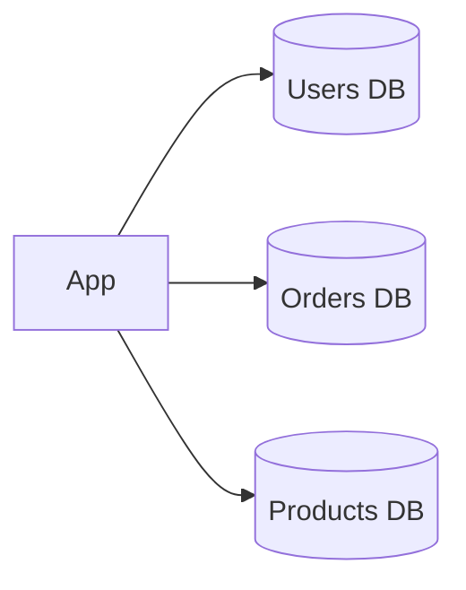

Federation forces you to make implicit coupling in a monolithic database explicit. That visibility is valuable—but the cost is that every place you previously relied on a SQL join across domains now becomes an application-side aggregation or an event-driven eventual consistency story.

## Diagram

