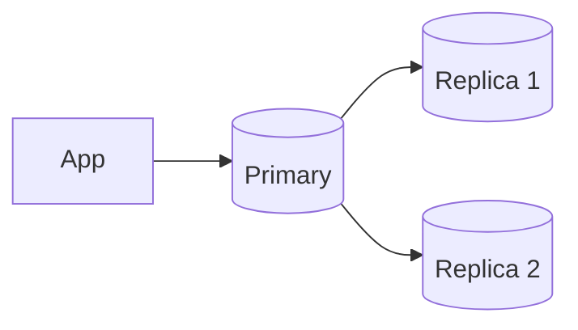

Replication is often combined with caching, but each solves a different bottleneck.

## Diagram

```mermaid
flowchart LR
  A[App] --> P[(Primary)]
  P --> R1[(Replica 1)]
  P --> R2[(Replica 2)]
```
