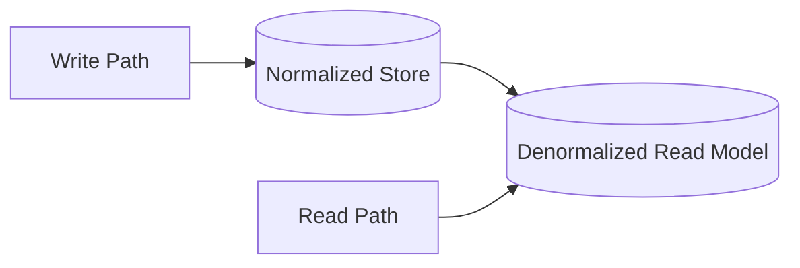

Denormalization is an optimization, not a design philosophy. It should be applied to specific query paths that have been measured as bottlenecks, not as a blanket approach. The moment you have two copies of data, you have the problem of keeping them consistent—make sure you have a plan.

## Diagram

