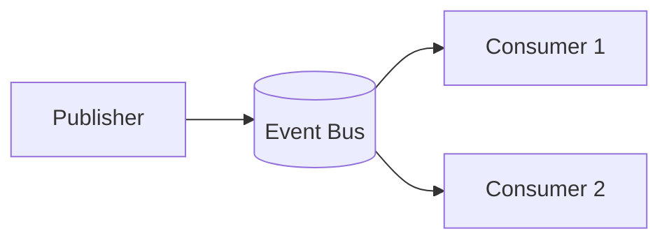

Event-driven architecture is powerful when teams manage event contracts as carefully as APIs.

## Diagram

```mermaid
flowchart LR
  P[Publisher] --> B[(Event Bus)]
  B --> C1[Consumer 1]
  B --> C2[Consumer 2]
```
