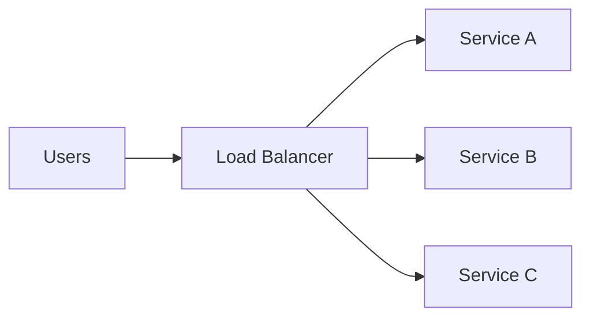

Load balancers are foundational because they make scale and failure handling predictable.

## Diagram

```mermaid
flowchart LR
  U[Users] --> LB[Load Balancer]
  LB --> S1[Service A]
  LB --> S2[Service B]
  LB --> S3[Service C]
```
