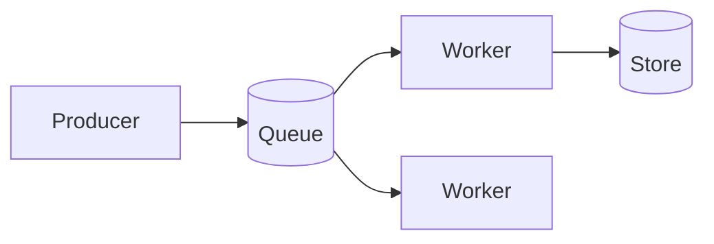

Queues help teams move from request-centric thinking to workflow-centric design.

## Diagram

```mermaid
flowchart LR
  P[Producer] --> Q[(Queue)]
  Q --> W1[Worker]
  Q --> W2[Worker]
  W1 --> DB[(Store)]
```
