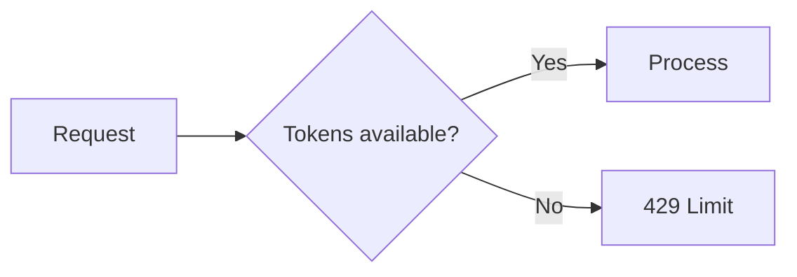

Rate limiting teaches one of the most common architecture tradeoffs: protecting the system may reduce user convenience.

## Diagram

```mermaid
flowchart LR
  R[Request] --> T{Tokens available?}
  T -->|Yes| P[Process]
  T -->|No| L[429 Limit]
```
