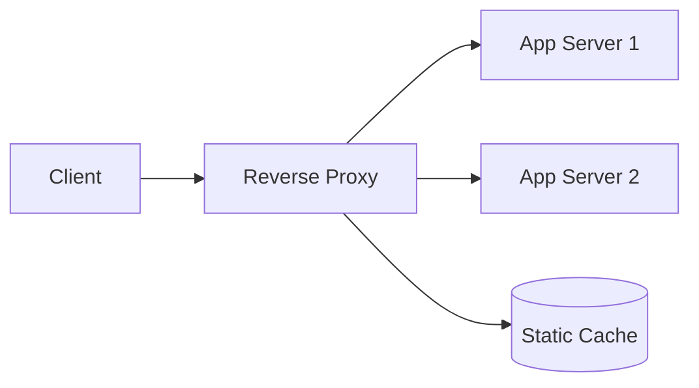

A reverse proxy is the first layer of defense in production deployments. It decouples the client-facing contract (URL structure, TLS version, compression) from the backend implementation, letting both evolve independently.

## Diagram

