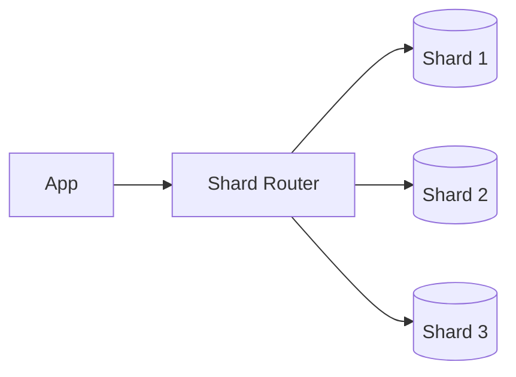

Sharding is rarely first choice; it is usually a last-mile scaling move.

## Diagram

```mermaid
flowchart LR
  A[App] --> R[Shard Router]
  R --> S1[(Shard 1)]
  R --> S2[(Shard 2)]
  R --> S3[(Shard 3)]
```
