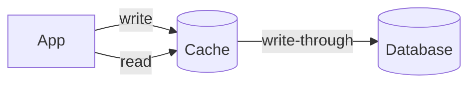

Write-through is the right choice when your system's reads care about freshness and writes are infrequent enough that the extra latency is acceptable. It shifts the consistency burden from the read path to the write path.

## Diagram

