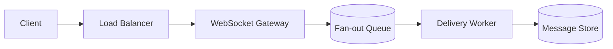

The chat scenario shows how patterns combine, and where complexity starts to appear as requirements increase.

## Diagram

```mermaid
flowchart LR
  Client --> LB[Load Balancer]
  LB --> Gateway[WebSocket Gateway]
  Gateway --> Queue[(Fan-out Queue)]
  Queue --> Worker[Delivery Worker]
  Worker --> DB[(Message Store)]
```
