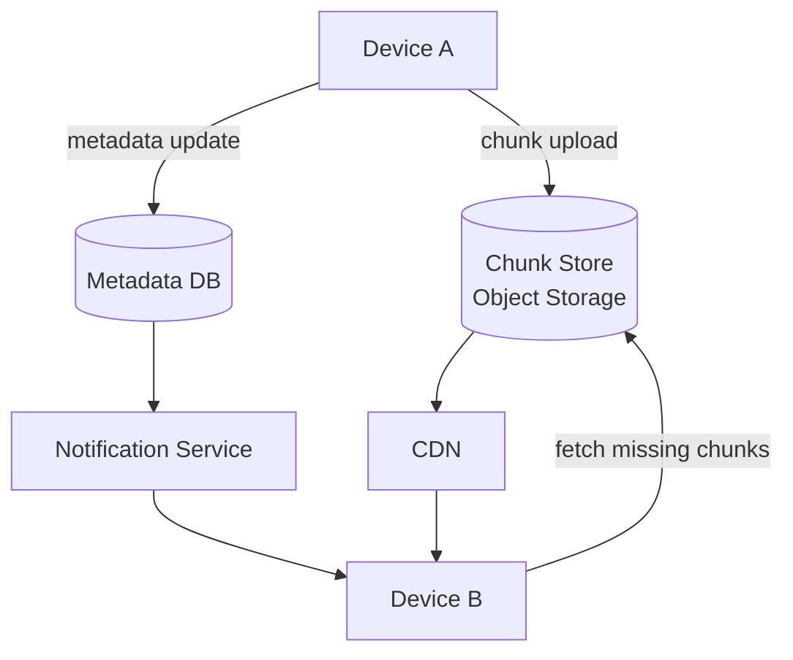

A file sync service is a practical exercise in making distributed state consistent across devices. The chunk-based design solves bandwidth efficiency; the metadata database solves versioning; the notification channel solves polling; and conflict detection solves concurrent edits. Each piece is independently addressable, but they only work reliably together.

## Diagram

