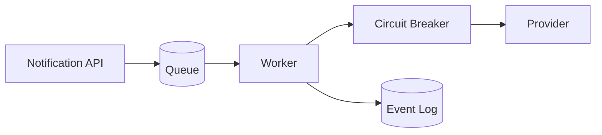

This scenario emphasizes practical tradeoffs between reliability, cost, and complexity in asynchronous systems.

## Diagram

```mermaid
flowchart LR
  API[Notification API] --> Q[(Queue)]
  Q --> W[Worker]
  W --> CB[Circuit Breaker]
  CB --> P[Provider]
  W --> Audit[(Event Log)]
```
