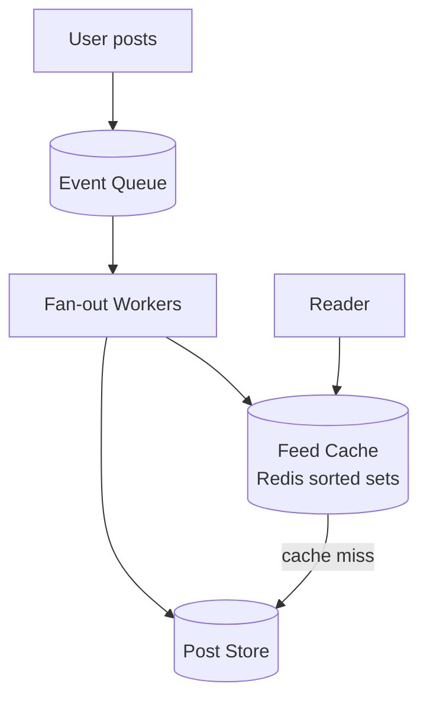

Designing a social feed surfaces one of the most instructive tradeoffs in distributed systems—fan-out on read versus fan-out on write. Neither extreme works universally; the production answer is nearly always a hybrid that handles the celebrity problem differently from regular accounts.

## Diagram

