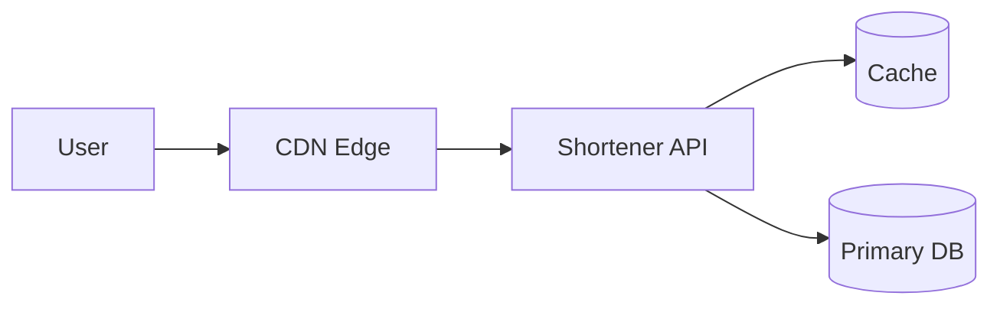

This scenario helps juniors reason about read-heavy systems where simple tradeoffs around caching and consistency matter.

## Diagram

```mermaid
flowchart LR
  User --> Edge[CDN Edge]
  Edge --> API[Shortener API]
  API --> Cache[(Cache)]
  API --> DB[(Primary DB)]
```
