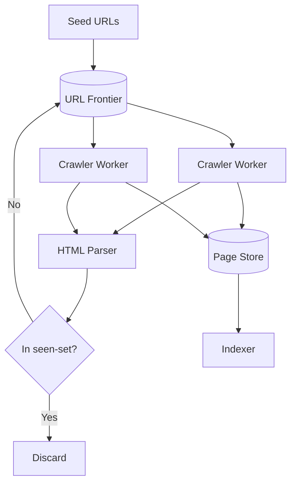

A web crawler is a distributed systems problem disguised as a networking task. The hard parts are deduplication at scale, polite crawling that does not abuse target servers, and the URL frontier design that determines which pages get crawled first. Getting those three right defines the difference between a toy and a production crawler.

## Diagram

